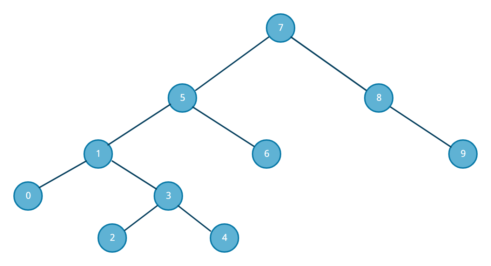

# Proje 3 : Binary Search Tree

***

[7, 5, 1, 8, 3, 6, 0, 9, 4, 2] dizisinin Binary-Search-Tree aşamalarını yazınız.

Root 7'dir. 5, root'un solunda kalır. Root'un sağında 8 bulunur.9, 8'in sağında kalır. 1, 5'in solunda kalır. 6, 5'in sağında kalır. 3, 1'in sağında kalır.  0, 1'in solunda kalır.
4, 3'ün sağında bulunur. 2, 3'ün solunda bulunur.
 

***                  